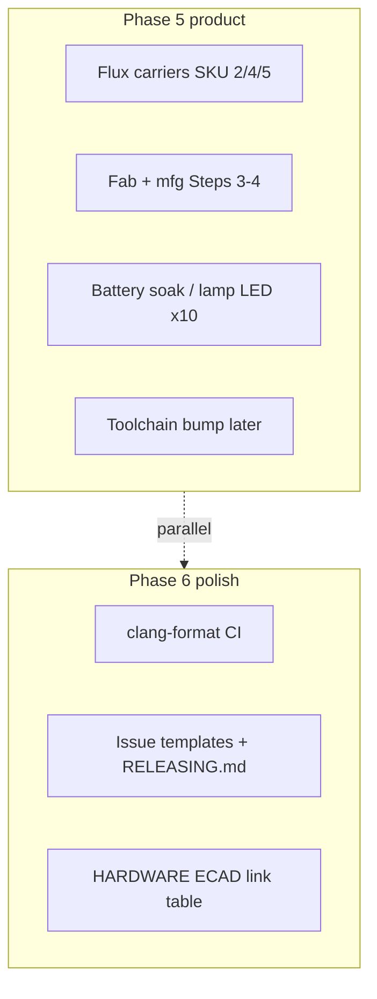
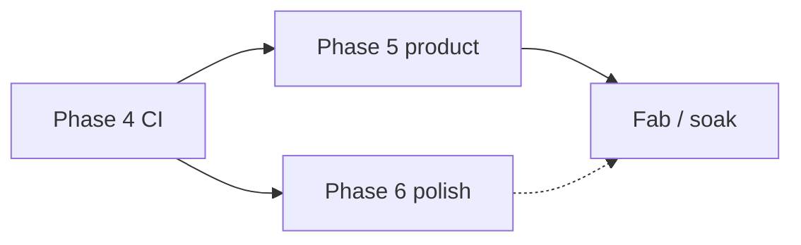

# Repository polish plan

Phased roadmap from “working firmware monorepo” to something you can hand to a collaborator, open-source, or put on a resume without apology. Each phase is shippable on its own.

**How to use this doc:** work top to bottom; check boxes as you go. Estimated effort is for a solo maintainer familiar with the codebase.

---

## Phase 0 — Documentation foundation ✅ complete

**Goal:** A stranger can clone, understand scope, and find build/hardware info.

| Task                                                                                              | Effort | Status |
| ------------------------------------------------------------------------------------------------- | ------ | ------ |
| Root [README.md](../README.md)                                                                    | S      | Done   |
| [docs/BUILD.md](BUILD.md), [docs/HARDWARE.md](HARDWARE.md), [docs/REPO_LAYOUT.md](REPO_LAYOUT.md) | S      | Done   |
| Remove `references.md` (content in `docs/BUILD.md`)                                               | S      | Done   |
| Track `docs/` in git; README notes five-piece roadmap (3 apps today, 2 planned)                   | S      | Done   |
| Fill empty `@brief` in `main.cpp` / `matter_task.`* / `bme680_task.cpp`                           | S      | Done   |

**Exit criteria:** README + docs answer “what is this?”, “how do I build?”, “what board?”

---

## Phase 1 — Quick hygiene ✅ complete

**Goal:** Remove obvious copy-paste and noise from version control.

| Task                                                                                                           | Effort | Status |
| -------------------------------------------------------------------------------------------------------------- | ------ | ------ |
| Replace `lilFlowerPal` comment in all `main/CMakeLists.txt` with project-neutral text                        | S      | Done   |
| Remove `iotDoorSensor/log.txt` from git (`git rm --cached`) and add `*.log` / `log.txt` to `.gitignore` | S      | Done   |
| Fix typo in `main/CMakeLists.txt` (`"main.cpp""matter_task.cpp"` missing space in binary sensor)               | S      | Done   |
| Keep `To-Do.MD` gitignored (local reference only; shared status in `docs/HARDWARE.md`)                           | S      | Done   |
| Add [CONTRIBUTING.md](CONTRIBUTING.md) stub (build, C++17, Matter callbacks on system layer)                   | S      | Done   |
| Migrate Cosmos style from `oldReadme.md` → [CODE_STYLE.md](CODE_STYLE.md) + root `.clang-format`             | S      | Done   |

**Exit criteria:** `git log` / `git diff` show only intentional source; no third-party project names in CMake.

---

## Phase 1½ — Cosmos style adoption ✅ complete

**Goal:** Match legacy CosmosIoT formatting and documentation without blocking feature work.

| Task | Effort | Status |
|------|--------|--------|
| [CODE_STYLE.md](CODE_STYLE.md) (naming, comments, Doxygen, editor setup) | S | Done |
| Root [`.clang-format`](../.clang-format) | S | Done |
| Link style guide from [CONTRIBUTING.md](CONTRIBUTING.md) and [README.md](../README.md) | S | Done |
| Doxygen blocks on all public `tasks/*.h` APIs | M | Done |
| Run `clang-format` on `main/` + `tasks/` via [format_sources.sh](../tools/scripts/format_sources.sh) | M | Done |
| `.editorconfig` + [`.vscode/settings.json`](../.vscode/settings.json) (`indent_size = 4`, `charset = utf-8`) | S | Done |
| Remove `oldReadme.md` after migrating style notes | S | Done |

**Closed as Plan A:** tooling + policy are done. **New and touched** project files follow [CODE_STYLE.md](CODE_STYLE.md); keep **upstream** esp-matter / CHIP names at API boundaries. Historical Matter-shaped / pre-style app code is **not** fully renamed — that is deferred to **Plan B** below (do not block Phase 5 carriers).

### Plan B — full Cosmos style compliance (revisit later)

**When:** after carrier fab, gift Beta soak, and firmware under test are stable — not before / during Flux layout.

**Why revisit:** older app code still mixes Matter-adjacent naming with Cosmos conventions. New tasks should already be Cosmos-style; Plan B is a dedicated cleanup pass, not day-to-day hygiene.

| Task | Effort | Notes |
|------|--------|--------|
| Audit `main/`, `tasks/`, `components/cosmos_*` for naming / Doxygen gaps | M | Skip IDF / esp-matter trees |
| Rename **owned** symbols to Cosmos rules (`snake_case`, `*_t`, pointer `pFoo`, etc.) | L | Do **not** rename CHIP / esp-matter types or callbacks |
| Fill any missing public-header Doxygen | M | Per [CODE_STYLE.md](CODE_STYLE.md) |
| `./tools/scripts/format_sources.sh` + clang-format CI green | S | Already enforced on PRs |
| Build all SKUs (`build_all.sh` / CI matrix) | M | Gate merge on green |

**Exit criteria:** owned project code matches Cosmos style; upstream boundaries unchanged; all apps build.

**Tracking:** unchecked item under [Tracking progress](#tracking-progress) — reopen as a GitHub issue when ready.

---

## Phase 2 — Layout consistency ✅ complete

**Goal:** Same rules in every firmware app.

| Task                                                                                                                | Effort | Status |
| ------------------------------------------------------------------------------------------------------------------- | ------ | ------ |
| Adopt **Option B** from [REPO_LAYOUT.md](REPO_LAYOUT.md): every task = `tasks/*.h` + `main/*.{cpp,c}`               | M      | Done   |
| Align `iotEnvironmentalSensor` for **esp32c5** (`sdkconfig.defaults`, CMake `esp32c5_devkit_c`; run `set-target`)    | M      | Done   |
| Add `sdkconfig.defaults` to apps that only had full `sdkconfig` (binary + environmental; dual-mode already had it)  | M      | Done   |
| Document C vs C++ policy in `docs/CONTRIBUTING.md`                                                                  | S      | Done   |
| Shared baseline [sdkconfig.defaults.matter-base](sdkconfig.defaults.matter-base)                                    | S      | Done   |

**Exit criteria:** New task added the same way in all three projects (`tasks/foo.h` + `main/foo.cpp`, register in `main/CMakeLists.txt`).

**Note:** Generated `sdkconfig` is gitignored (Phase 4); local copies are created by `idf.py set-target` from `sdkconfig.defaults`.

---

## Phase 3 — Shared Matter component ✅ complete

**Goal:** One place for duplicated factory reset / fabric / commissioning-window logic.

| Task                                                                           | Effort | Status |
| ------------------------------------------------------------------------------ | ------ | ------ |
| Create `components/cosmos_matter_common/` per [REPO_LAYOUT.md](REPO_LAYOUT.md) | M      | Done   |
| Extract `factory_reset_task` first (smallest, clearest win)                    | M      | Done   |
| Extract shared `app_event_cb` / identification stubs if identical              | M      | Done   |
| Wire `EXTRA_COMPONENT_DIRS` in each app `CMakeLists.txt`                       | S      | Done   |
| Build all three apps locally after extraction                                  | S      | Done   |

**Exit criteria:** Bugfix to factory reset is one commit, not three.

**Shared API:** `components/cosmos_matter_common/include/factory_reset_task.h`, `cosmos_matter_events.h`, `cosmos_matter_ota.h`

---

## Phase 4 — Reproducible builds & CI ✅ complete

**Goal:** `main` always compiles in a clean environment.

| Task                                                                                                  | Effort | Status |
| ----------------------------------------------------------------------------------------------------- | ------ | ------ |
| Pin ESP-IDF + esp-matter versions in [BUILD.md](BUILD.md)                                              | S      | Done   |
| Add [build_all.sh](../tools/scripts/build_all.sh) with known targets / `FRESH_CONFIG=1` for CI parity  | S      | Done   |
| Add [.github/workflows/build.yml](../.github/workflows/build.yml) matrix                               | L      | Done   |
| Commit `dependencies.lock` per app; remove from `.gitignore`                                          | S      | Done   |
| Stop committing `sdkconfig`; gitignore + rely on `sdkconfig.defaults` + `idf.py set-target`            | M      | Done   |

**Exit criteria:** PRs get a green build check without manual “works on my machine.”

**Note:** CI runs on push/PR to `main` via [build.yml](../.github/workflows/build.yml); confirm the first green matrix on the Actions tab after each workflow change.

---

## Phase 5 — Product line completeness (in progress)

**Goal:** Match the “five piece” name and production readiness.

**Next up:** Flux carrier PCB (Flux.ai) → user-test units → flash/ship (MANUFACTURING Steps 3–4); MVP soak (battery tuning only if field data warrants).

**In flight (Jul 2026):** Binary sensor MVP deployed and **soaking** on battery; carrier PCB layout in **Flux.ai**; beta factory data generated (`out/mfg/beta-batch-24-07-2026`, 10× per SKU).

| Task                                                                                          | Effort | Status |
| --------------------------------------------------------------------------------------------- | ------ | ------ |
| Battery / power management — `components/cosmos_battery`, Matter Power Source, SKU HA YAML in `home-assistant/packages/` | L      | Done — MVP field tuning via OTA; divider/BOM in [HARDWARE.md](HARDWARE.md) |
| Battery field tuning — sample interval, sleep/TX duty, divider accuracy, % curve thresholds   | M      | Soaking — revisit via OTA only if MVP data shows need |
| OTA mandatory — requestor + `CHIP_OTA_IMAGE_BUILD` on every SKU (shared `cosmos_matter_ota`) | M      | Done for SKUs 1–5 |
| Manufacturing: [MANUFACTURING.md](MANUFACTURING.md) + [`tools/mfg/`](../tools/mfg/) per-SKU scripts | M      | Done — Steps 1–2 validated (Jul 2026 beta batch); Steps 3–4 (flash/ship) after PCB manufacture |
| Hardware bring-up checklist (commission, attributes, factory reset, battery) in [HARDWARE.md](HARDWARE.md) | M      | Done — binary sensor prototype validated Jul 2026 |
| Add firmware app #5 (`iotDoorIntercom`) — Matter + MJPEG MVP, OTA-ready                      | L      | Done (MVP); WebRTC / Matter Camera later |

**Moved to separate repo:** [cosmos-ha-field](https://github.com/CosmosKiller/cosmos-ha-field) — HA commissioning, Pi field OTA, chip-tool OTA procedure, Tier 2/3 OTA planning.

---

## Phase 5.a — `iotDoorIntercom` crown jewel (post-MVP)

SKU 5 MVP (Matter + event-gated MJPEG + OTA) is **done**. This phase hardens the product model before WebRTC.

| Task | Effort | Status |
|------|--------|--------|
| Drop door/window `EVT_SOURCE_CONTACT` from intercom (not this SKU) | S | Done |
| Tamper / anti-theft: `TAMPER_PIN` (GPIO3) → `EVT_SOURCE_PANIC` → stream + LED; siren GPIO + Matter alarm event | M | Done — GPIO4 LED‖buzzer latched until HA mounted-OnOff clear; full Alarm cluster later |
| Matter endpoints: replace OnOff light-switch doorbell with **`doorbell`** (momentary Switch + Chime client); keep stream gate as OnOff **or** migrate to Camera AV when WebRTC lands | M | Done (HA-first) — `generic_switch` `0x000F` for HA `event.*`; true `endpoint::doorbell` `0x0148` after esp-matter + HA bump |
| HA “view camera” control: keep OnOff plug as stream enable for MJPEG era; long-term Matter **Camera** / **Intercom** (WebRTC) — do not use Matter Intercom device type until media stack exists | M | Done (HA-first) — `home-assistant/packages/cosmos_door_intercom.yaml` + Lovelace door view; WebRTC deferred |
| HTTPS for `/stream` (self-signed or provisioned cert; `esp_https_server`) — browser trust + cert storage design | M | Done — `esp_https_server` port 443 + embedded Beta self-signed cert; HA `verify_ssl: false`; mfg/provisioned certs later |
| Matter Camera + WebRTC (esp-matter camera / esp-webrtc) on S3 or P4 path | XL | Deferred |

**Endpoint guidance (current SDK):**

| Role | Today (MVP) | Better fit |
|------|-------------|------------|
| Physical doorbell button | `generic_switch` `0x000F` (HA `event.*`) | Later `endpoint::doorbell` `0x0148` when esp-matter + HA support it |
| Stream enable from HA | `on_off_plug_in_unit` | Keep for MJPEG; later Camera AV Stream Management / WebRTC |
| Full A/V intercom | — | `endpoint::intercom` / video doorbell — requires WebRTC |

**Docs:** keep the completed SKU 5 MVP plan as historical; track crown-jewel work **here**, not by rewriting that plan.

---

## Phase 6 — Open-source polish (parallel with Phase 5)

**Runs in parallel** with Phase 5 fabrication / soak / Flux carriers. Does **not** block PCB fab or gift Beta.

| Task | Effort | Status |
|------|--------|--------|
| Doxygen on all `tasks/*.h` (see [CODE_STYLE.md](CODE_STYLE.md); done in Phase 1½) | M | Done |
| CI: `clang-format --dry-run` on app `main/` / `tasks/` + shared components | S | Done — [`.github/workflows/clang-format.yml`](../.github/workflows/clang-format.yml) |
| Issue templates / release tags per app `PROJECT_VER` | S | Done — [`.github/ISSUE_TEMPLATE/`](../.github/ISSUE_TEMPLATE/) + [RELEASING.md](RELEASING.md) |
| Schematic or link to hardware repo in [HARDWARE.md](HARDWARE.md) | S | Done — ECAD tracking table (paste Flux URLs when projects exist) |

---

## Suggested order

**Track A (Phase 5):** Flux carriers for SKU 1–2 / 4–5; lamp LED×10; fab → mfg Steps 3–4; battery soak; later toolchain bump + `endpoint::doorbell`.  
**Track B (Phase 6):** clang-format CI, issue templates, release tagging docs, ECAD link table — **done** (paste Flux URLs when projects exist).  
**Plan B (style, later):** full Cosmos naming compliance on owned code — see [Phase 1½ Plan B](#plan-b--full-cosmos-style-compliance-revisit-later); after Beta soak.  
**Done (battery):** `cosmos_battery` on SKU 2/4 (GPIO0) and SKU 5 (GPIO5).  
**Later:** Matter Camera + WebRTC.  
**Done (Phase 5 / 5.a so far):** SKU MVP + generic_switch doorbell + HTTPS `/stream` + latched tamper siren + HA-first packages.  
**Separate repo:** [cosmos-ha-field](https://github.com/CosmosKiller/cosmos-ha-field) — HA + Pi OTA.

---

## Tracking progress

Copy into a GitHub issue or project board:

- [x] Phase 0 complete
- [x] Phase 1 complete
- [x] Phase 1½ complete (Plan A — tooling + adopt-on-touch)
- [ ] Plan B — full Cosmos style compliance on owned code (after Beta soak; see Phase 1½)
- [x] Phase 2 complete
- [x] Phase 3 complete
- [x] Phase 4 complete
- [x] Phase 5 — battery / power management (`components/cosmos_battery`, Power Source, SKU HA YAML)
- [ ] Phase 5 — battery field tuning (divider/BOM, sample interval, sleep — MVP + OTA)
- [x] Phase 5 — OTA mandatory for all apps (`cosmos_matter_ota` + `CHIP_OTA_IMAGE_BUILD` on SKUs 1–5)
- [x] Phase 5 — `iotDoorIntercom` MVP (Matter + MJPEG on XIAO S3 Sense)
- [x] Phase 5 — hardware bring-up checklist ([HARDWARE.md](HARDWARE.md) — binary sensor prototype)
- [x] Phase 5 — manufacturing docs ([MANUFACTURING.md](MANUFACTURING.md), `tools/mfg/`; Steps 1–2 done, 3–4 after PCB)
- [ ] Phase 5 — Flux carriers SKU 1/2/4/5 → fab → flash/ship (power architecture locked in HARDWARE.md)
- [x] Phase 5.a — generic_switch doorbell + HTTPS `/stream` + tamper contact_sensor
- [x] Phase 5.a — tamper siren GPIO4 + Matter OnOff clear (latched); full Alarm cluster later
- [ ] Phase 5.a — migrate to `endpoint::doorbell` after toolchain bump
- [ ] Phase 5.a — Matter Camera + WebRTC (after HTTPS/doorbell model)
- [x] Phase 6 — clang-format CI + format script covers all SKUs
- [x] Phase 6 — issue templates + [RELEASING.md](RELEASING.md)
- [x] Phase 6 — HARDWARE ECAD link table (URLs TBD)
- HA / Pi fleet — [cosmos-ha-field](https://github.com/CosmosKiller/cosmos-ha-field)

Update the **Status** section in the root README when major milestones land.